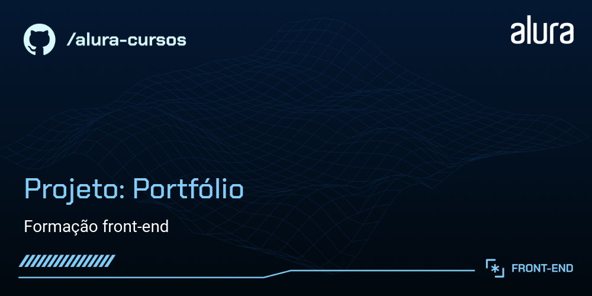

# Portfólio

Esse projeto foi desenvolvido durante os cursos de HTML e CSS da **Alura** com afins de aprendizados.

## Tecnologias

- HTML
- CSS
- Flex-box
- Visual Studio Code
- Figma

## Feito por:

Eduardo Romeiro

### Contato:

- [Linkedin](https://www.linkedin.com/in/duromeiro/)
